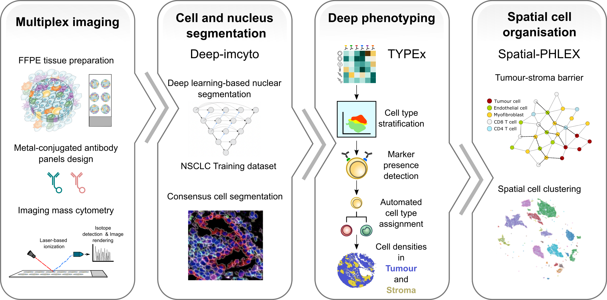

TRACERx-PHLEX: One-stop pipeline for robust and comprehensive multiplexed imaging analyses
=============

**TRACERx-PHLEX** is a user-friendly pipeline for an end-to-end analysis of multiplex imaging data.

        

Quick start
+++++++++++++++
1. Install `Nextflow <https://www.nextflow.io/docs/latest/getstarted.html#installation>`_
2. Install `Singularity <https://www.sylabs.io/guides/3.0/user-guide/>`_ or `Docker <https://docs.docker.com/engine/installation/>`_.
3. `Download <https://>`_ example dataset
4. Run TRACERx-PHLEX 
.. code-block:: console
   nextflow run phlex/main.nf

Tutorial
+++++++++++++++
Detailed tutorial on parameters, input files and functionalities is available on `tracerx-phlex.readthedocs.io/ <http://tracerx-phlex.readthedocs.io/>`_.

Citations
+++++++++++++++
The pipeline is described in [Journal X](https://biorxiv.org).
