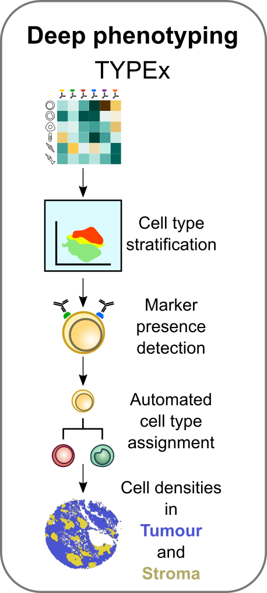

.. _TYPEx_anchor:

        
Cell phenotyping with TYPEx
===========================

Performs identification, annotation and quantification of cell subpopulations and marker expression. Uses prior knowledge -> input files where this is configured are needed...

Parameters
============
Settings for which clustering approaches to use and which set of markers

Inputs and outputs
==================

- cell_type_annotation.json
- typing_params.json
- optional: tissue_segmentation.json where annotations of tissue can be overlaid and quantified.

Usage
=============
How to configure on your own dataset:
 

