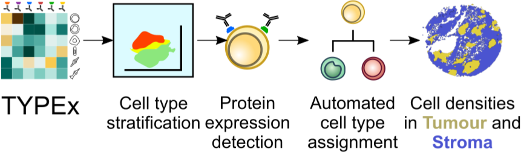

.. _TYPEx_anchor:        
*No more hunt-and-pecking! Detecting single-cell protein expression and cell phenotyping with TYPEx*

|workflow| 

TYPEx uses multiplexed imaging to detect protein expression on single cells, annotate cell types automatically based on user-provided definitions and quantify cell densities per tissue area. It can be customised with input parameters and configuration files, allowing it to perform an end-to-end cell phenotyping analysis without the need for manual adjustments. 

Input Files and Parameters
==================

The minimal input for TYPEx is a matrix of cell intensities for each protein and a file with cell definitions specific to the user’s antibody panel.

#. *Input table* - The input matrix has values that summarise the intensity of a protein per cell object, such as mean intensity, independently of the imaging modality or antibody tagging technique. 

+-----------------+-----------+----+----+------------------+-----------+----+-----------+---+---+
| Cell Object ID  | Image ID  | X  | Y  | Area [optional]  | Marker 1  | …  | Marker N  |   |   |
+=================+===========+====+====+==================+===========+====+===========+===+===+
|                 |           |    |    |                  |           |    |           |   |   |

 

#. *cell_type_annotation.json* The cell-type definitions file includes a list of cell lineages and the corresponding marker proteins that together can be used to identify a cell lineage. When designing this file it is important to ensure that each cell in the cohort can be covered by these definitions. Some markers, such as CD45 and Vimentin, are expressed by multiple cell lineages. These shared proteins are used to infer a hierarchy of cell lineages, which is later considered for cell stratification and annotation. An example of a cell-type definitions file is shown below for TRACERx analyses, where we defined 13 major cell types targeted by our two antibody panels, while ensuring that each cell in the cohort can be covered by these definitions. 

#. *typing_params.json* - settings for which clustering approaches to use and which set of markers

Optional input paramteers
==================

tissue_segmentation.json where annotations of tissue can be overlaid and quantified.

Usage
=============
 
Outputs
=============

TYPEx outputs summary tables that can be readily interrogated for biological questions. These include densities of identified cell phenotypes, a catalogue of the expressed proteins and combinations thereof, quantified across the whole tissue area or within each tissue compartment. These outputs are generated by four analytical steps: cell stratification, detection of protein expression, and automated cell annotation, followed by a quantitative summary per tissue compartment (Figure 4a).

